# job4j_cars
Это приложение для создания площадки продажи машин.
## Техническое задание на проект содержит такие требования:
1. Основная страница - таблица со всеми объявлениям машин на продажу.
2. На странице должна быть кнопка - добавить новое объявление.
3. Переходить на страницу добавления.
4. Должны быть категории машины, марка, тип кузова и тд. Пример с сайта auto.ru.
5. Можно добавлять фото.
6. Объявление имеет статус продано или нет.
7. Должны существовать пользователи. Пользователь, подавший объявление,
   только он может менять статус.
8. 
## Используемые технологии:


[](https://hibernate.org/)


Перед запуском установите:
- PostgreSQL 14
- Java 17
- Apache Maven 3.x

## Запуск приложения

1. Создайте базу данных carrs:
```sql
create database carrs;
```

2. Запуск приложения производится с использованием maven.
   Перейдите в корневой каталог проекта и в командной строке
   выполните команды:
```
    mvn clean install
    mvn spring-boot:run
```
### Описание:
Перед использованием приложения надо пройти регистрацию
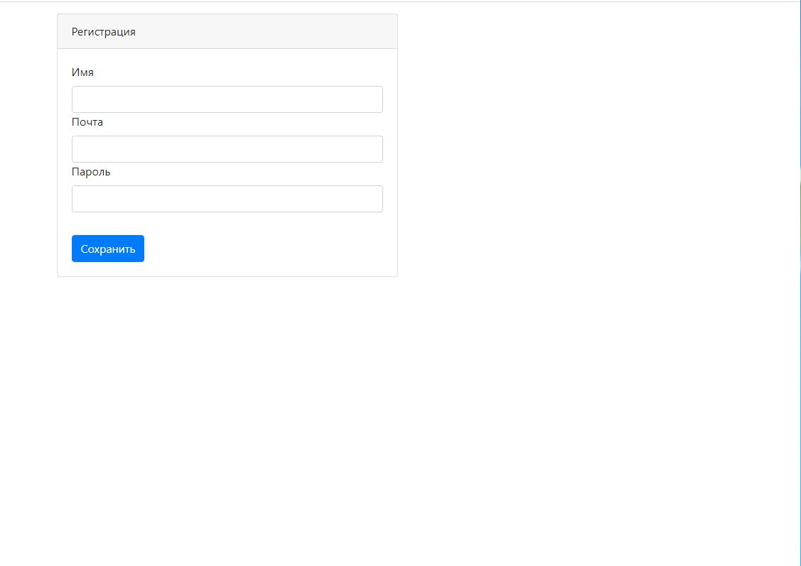
Пользователь заполняет поля
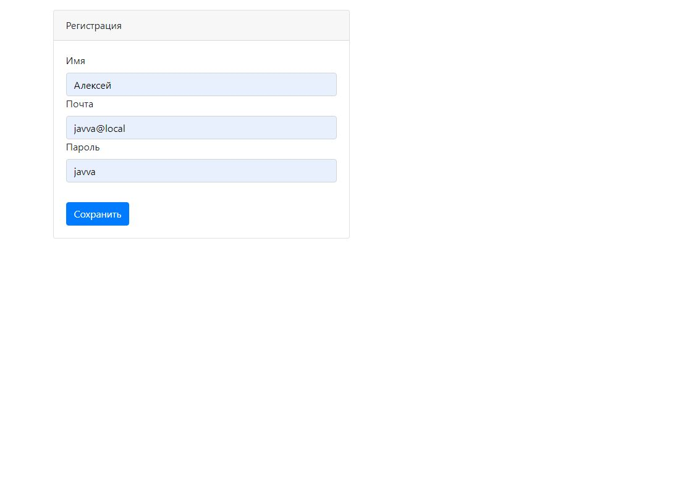
и попадает на страницу авторизации,
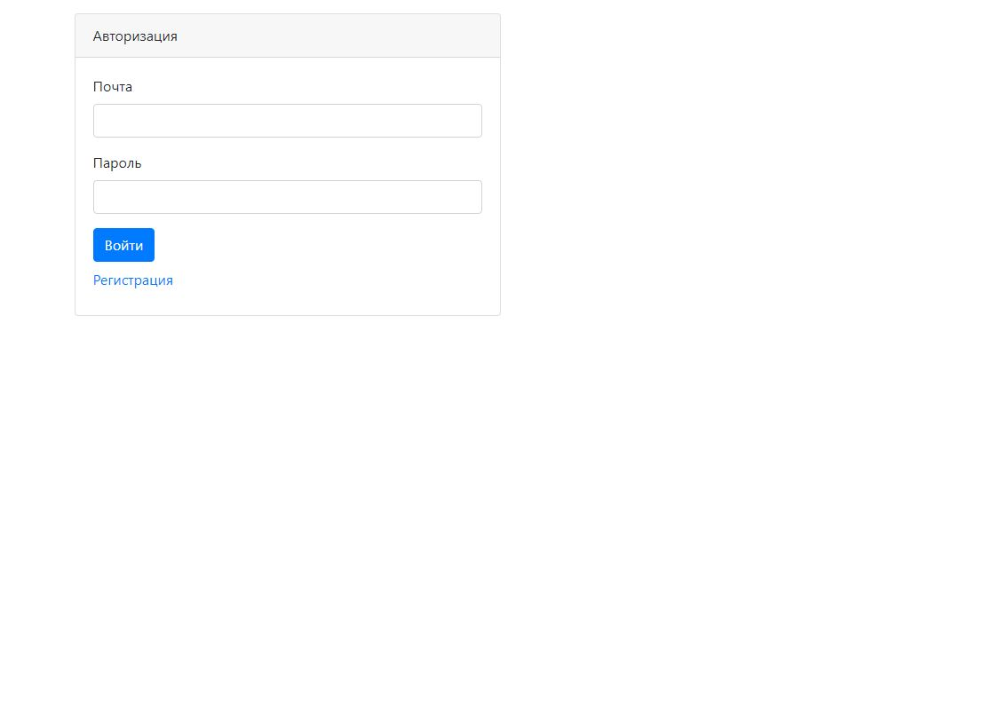
где вводит свои регистрационные данные.
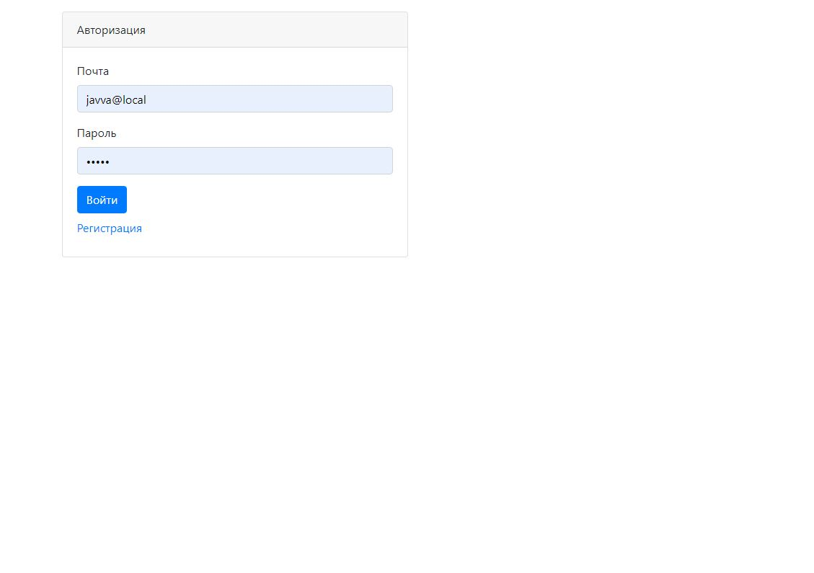
После регистрации пользователю доступны 
объявления, которые находятся в системе.
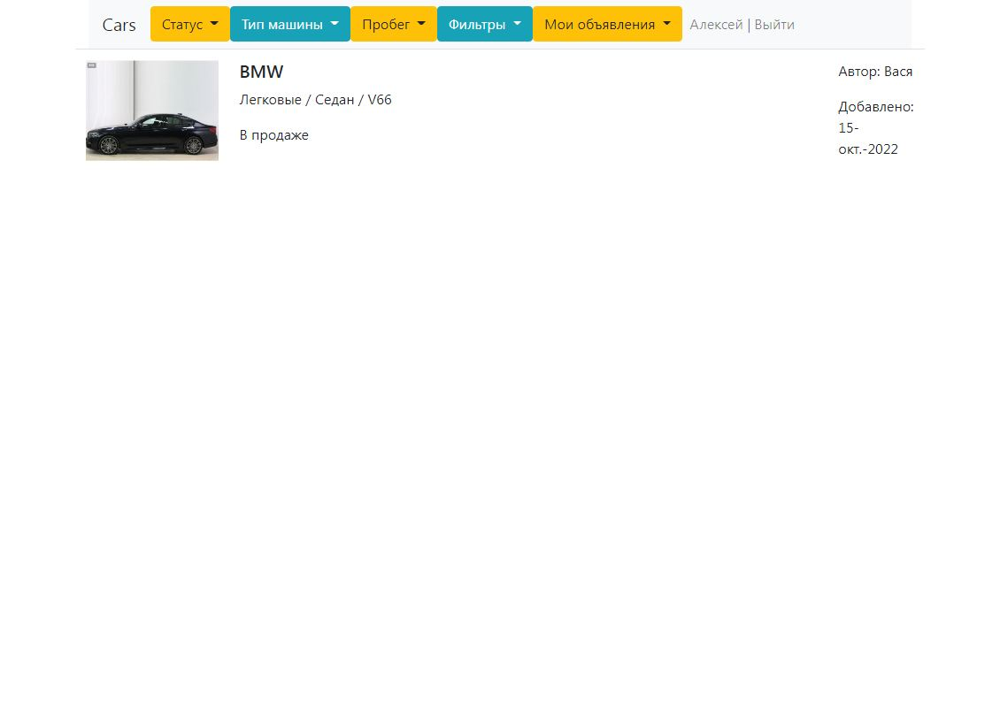
Можно отобрать объявления по их статусу,
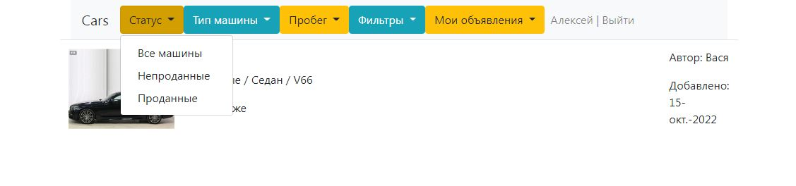
типу автомобилей,
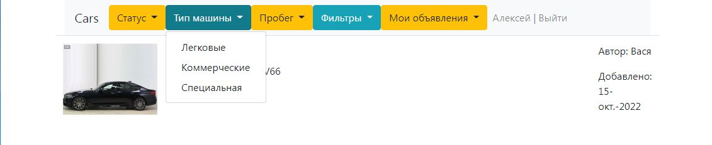
пробегу,
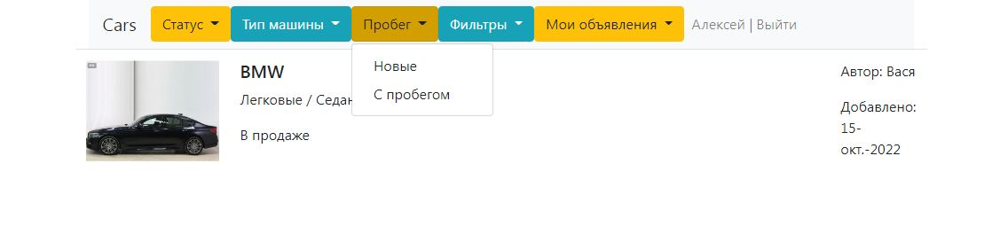
настроить свои фильтры для отображения.
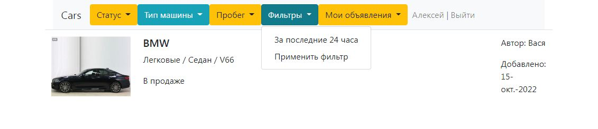
Можно разместить свое объявление.
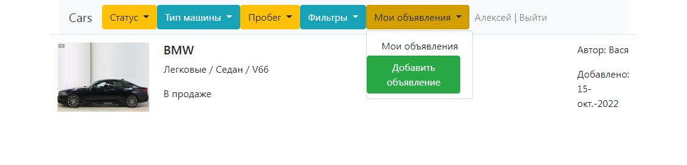
И посмотреть список объявлений после добавления
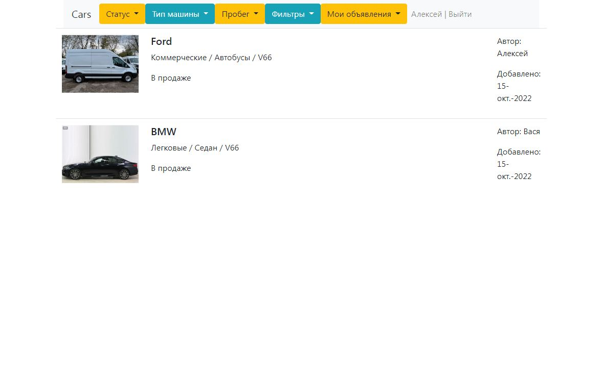
При нажатии на фотографию машины можно посмотреть детали объявления.
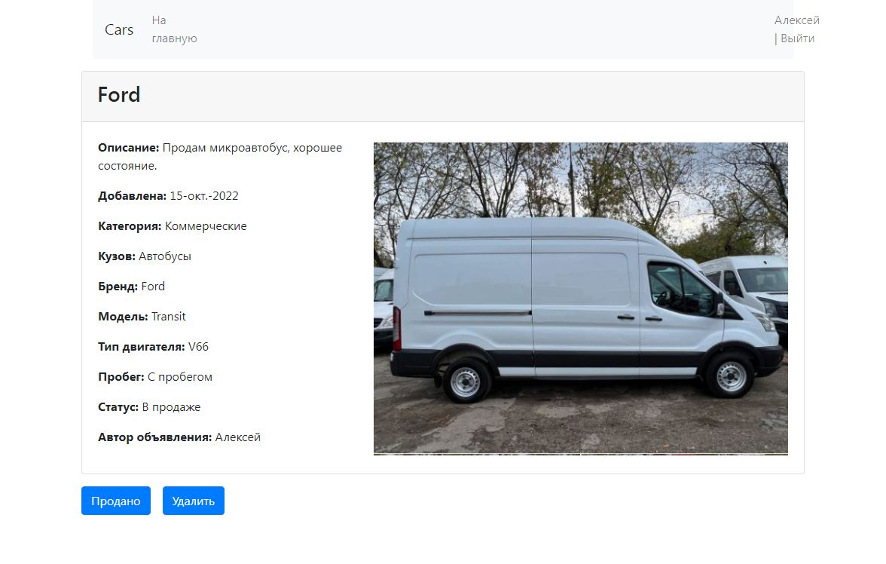

Связаться со мной можно по электронной почте a_esipov_it@list.ru
или в телеграм  @Alex46volokno


<div id="socials" align="center">
    <!-- <a href="linkedin-url">
    
  </a> -->

  <a href="https://t.me/alex46volokno">
    
  </a>
</div>


